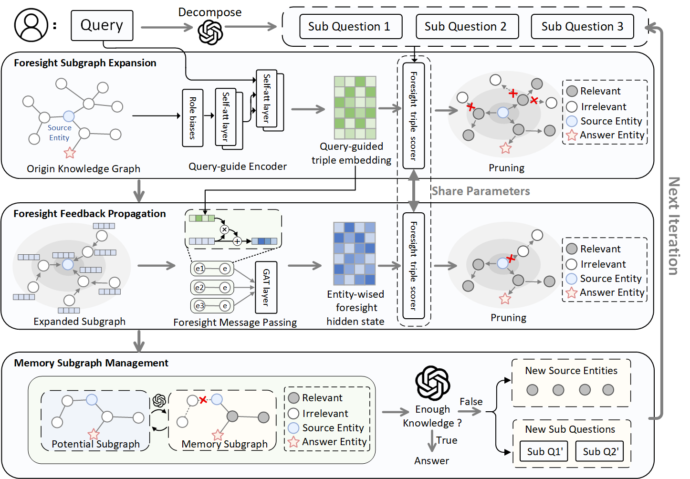

# Foresight over Graph (FoG)
##  Overview


##  General Setup 

### Environment Setup
```
conda create -n fog python=3.8
conda activate fog
pip install -r requirement.txt
```

###  Freebase KG Setup

Below steps are according to [Freebase Virtuoso Setup](https://github.com/dki-lab/Freebase-Setup). 
#### How to install virtuoso backend for Freebase KG.

1. Clone from `dki-lab/Freebase-Setup`:
```
cd Freebase-Setup
```


2. The latest official Freebase data dump of Freebase can be downloaded [here](https://developers.google.com/freebase).

    Virtuoso DB file can be downloaded from [here](https://www.dropbox.com/s/q38g0fwx1a3lz8q/virtuoso_db.zip) (WARNING: 53G+ disk space is needed):
```
tar -zxvf virtuoso_db.zip
```

3. Managing the Virtuoso service:

To start service at `localhost:3001/sparql`:
```
python3 virtuoso.py start 3001 -d virtuoso_db
```

and to stop a currently running service at the same port:
```
python3 virtuoso.py stop 3001
```

A server with at least 100 GB RAM is recommended.


### Development Configuration

Before running the project, make sure to fill in the **LLM** and **Embedding** settings in `config/config-dev.yml`. 
These parameters (e.g., provider, model name, API key, base URL) are required for LLM- and embedding-related features to work properly.

**Field descriptions**

* `model_name`: The model identifier to use (for embedding / chat completion).
* `base_url`: The API endpoint base URL for your provider.
* `api_key`: Your provider API key (keep it private).

### Run

Use the `dataset` argument to select which dataset to run the pipeline on.
- `cwq`: ComplexWebQuestions (CWQ)
- `webqsp`: WebQSP 

```bash
# Run with CWQ dataset
python main dataset=cwq

# Run with WebQSP dataset
python main dataset=webqsp
